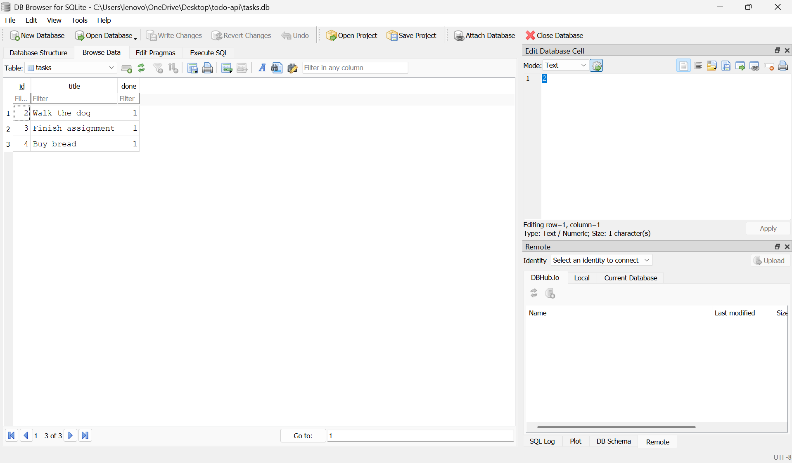

# Task API

A CRUD API for managing a to-do list, built with FastAPI and backed by a SQLite database. Built as part of the FlyRank Backend Track internship (Week 2: in-memory CRUD, Week 3: connected to SQLite).

## What this is
A REST API supporting full CRUD on tasks: create, read, update, and delete. Data is stored persistently in a SQLite database (`tasks.db`), so it survives server restarts. Includes interactive Swagger UI docs.

## Why SQLite
SQLite was chosen because it's a single file with zero setup — no separate database server to install or run. It's perfect for a small project like this: the whole database is just `tasks.db`, created automatically the first time the app runs.

## Where the database lives
`tasks.db` is created automatically in the project folder the first time you run the app. It's git-ignored, so every fresh clone of this repo starts with a brand new, empty database that seeds itself with 3 example tasks.

## How to run it
```bash
python3 -m venv venv
source venv/bin/activate       # Windows: venv\Scripts\Activate.ps1
pip install fastapi uvicorn
uvicorn main:app --reload
```
Then visit `http://localhost:8000/docs` for the interactive docs. `tasks.db` will be created automatically on first run, seeded with 3 example tasks.

## Endpoints

| Method | Path | Description |
|---|---|---|
| GET | / | API info |
| GET | /health | Health check |
| GET | /tasks | List all tasks |
| GET | /tasks/{id} | Get one task |
| POST | /tasks | Create a task |
| PUT | /tasks/{id} | Update a task |
| DELETE | /tasks/{id} | Delete a task |

## Example request

```
$ curl -i http://localhost:8000/tasks/2
HTTP/1.1 200 OK
content-type: application/json

{"id":2,"title":"Walk the dog","done":1}
```

## Swagger UI


## Exploring the database directly

Data can also be viewed and edited directly using [DB Browser for SQLite](https://sqlitebrowser.org/). Example query run in Stage 4:

```sql
UPDATE tasks SET done = 1;
```
This marked every task as done, with 3 rows affected. After saving, the API immediately reflected the change on the next request — confirming the API and DB Browser read and write the same underlying file.



## Notes
- All CRUD operations use parameterized SQL queries (`?` placeholders) to safely handle user input.
- The database and table are created automatically if missing; 3 example tasks are seeded only when the table is empty, so restarting the server never duplicates them.
- Data now survives a server restart — this was the core limitation fixed in this stage (previously, an in-memory list reset on every restart).