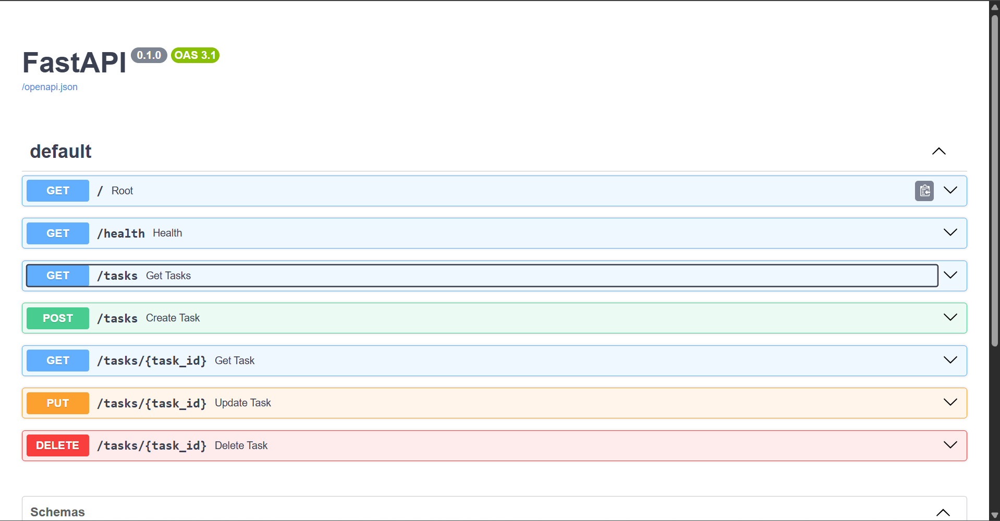

# Task API

A simple CRUD API for managing a to-do list, built with FastAPI. Built as part of the FlyRank Backend Track internship, Week 2.

## What this is
An in-memory (no database) REST API supporting full CRUD on tasks: create, read, update, and delete. Includes interactive Swagger UI docs.

## How to run it
```bash
python3 -m venv venv
source venv/bin/activate       # Windows: venv\Scripts\Activate.ps1
pip install fastapi uvicorn
uvicorn main:app --reload
```
Then visit `http://localhost:8000/docs` for the interactive docs.

## Endpoints

| Method | Path | Description |
|---|---|---|
| GET | / | API info |
| GET | /health | Health check |
| GET | /tasks | List all tasks |
| GET | /tasks/{id} | Get one task |
| POST | /tasks | Create a task |
| PUT | /tasks/{id} | Update a task |
| DELETE | /tasks/{id} | Delete a task |

## Example request

```
$ curl -i http://localhost:8000/tasks/1
HTTP/1.1 200 OK
content-type: application/json

{"id":1,"title":"Buy milk","done":false}
```

## Swagger UI



## Notes
Data is stored in memory only — it resets when the server restarts. This is intentional for this stage of the project; persistence with a database comes in Week 3.